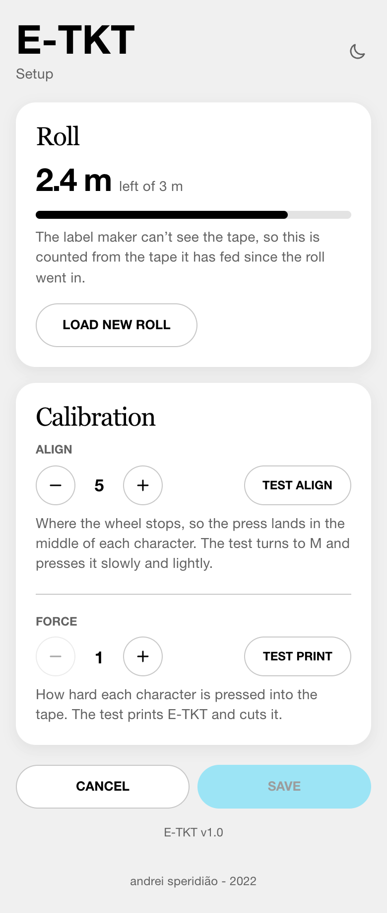
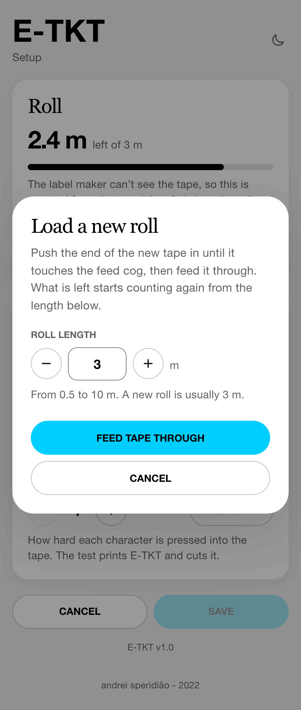

# ➰ **label reel**

----

The E-TKT uses generic 9mm DYMO-compatible label reel. They are cheap and come in different colors.

## to add a new reel

### 1. find the slit on the back of the machine, between the J_top and the C_wall_track

### 2. place the tape on it

### 3. make sure the tape is touching the cog and the metal bearings

### 4. in the app, go to "SETUP" and press "LOAD NEW ROLL", check step 3 again, then press "FEED TAPE THROUGH" and wait

The machine can't see the tape, so the app counts what is left on the roll: the roll length you give here, minus the tape fed since.
The length starts at the last roll's, and a new roll is usually 3 m.
If yours is a different length, or you are putting back a part-used roll, set its length before feeding it through.
"MAX", in the quantity of labels to print, is as many as that count says will fit.

----

### PS: if the tape is skidding, try tightening the m4 screw on the feeder mechanism

